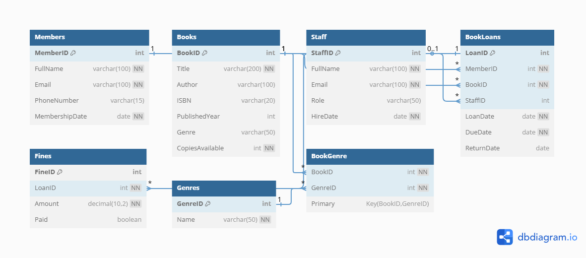

# 📚 Library Management System

## Project Description
This project is a simple **Library Management System** designed using **MySQL**. It tracks:
- Members
- Books and their genres
- Loans issued and returned
- Staff responsible
- Fines applied on late returns

## How to Set Up
1. Clone this repository.
2. Open MySQL Workbench or VS Code (with SQL extension).
3. Import and run the `libraryDB.sql` script.
4. The database `LibraryDB` and all tables will be created.

## 🗂️ Project Structure
- `libraryDB.sql`: The main SQL file with all CREATE TABLE statements, constraints, and relationships.
- `README.md`: This file.
- `ERD.png`: *(Include a screenshot or link to an online ERD diagram if available)*

## ERD

## ✅ Features
- Proper Primary and Foreign Keys
- Unique and NOT NULL constraints
- 1-1, 1-M, and M-M relationships
- Normalized design (up to 3NF)

